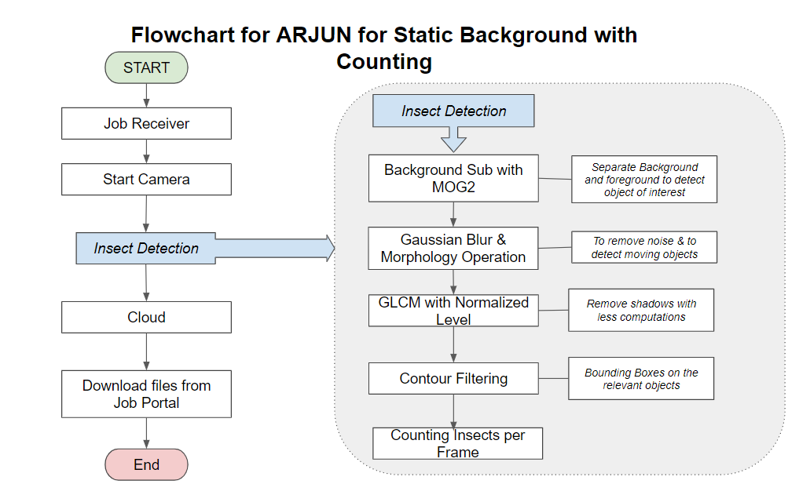
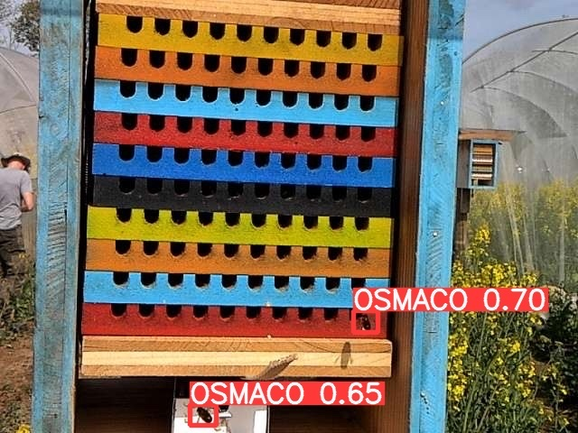
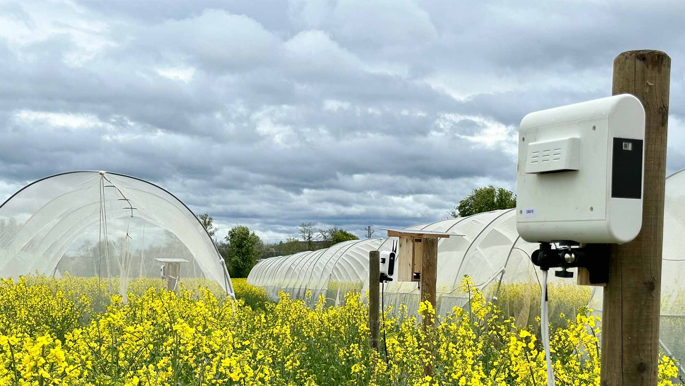
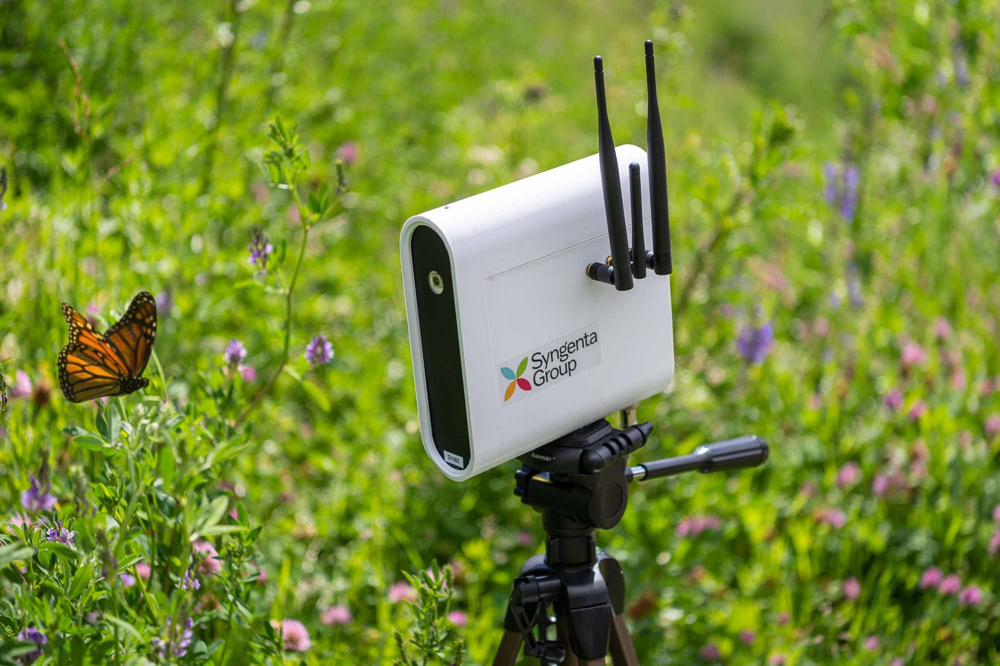
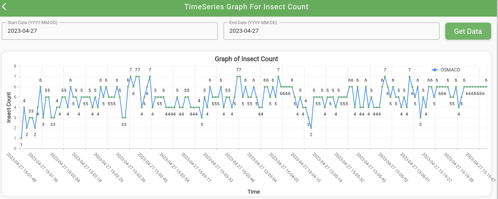

# Biodiversity Sensor Project (motion detection code)

[Biodiversity Sensor Project](https://www.syngentagroup.com/en/sustainability/biodiversity-sensor) — developing a collective technology to generate the data needed to protect and restore biodiversity. This repository contains the code for the motion detection part.

- [Introduction](#introduction)
  - [What is the Biodiversity Sensor Project?](#what-is-the-biodiversity-sensor-project)
- [Software flowchart](#software-flowchart)
- [Results](#results)
- [Contributing](#contributing)
- [License](#license)

## Introduction

### What is the Biodiversity Sensor Project?

The Biodiversity Sensor is a system for the reliable, autonomous, low-cost collection and sharing of biodiversity data. The system will be low-cost, solar-powered, using machine-learning algorithms to identify and quantify moving species automatically, autonomously, reliably and at scale. Data will be shared in leading biodiversity platforms with farmers, scientists, policymakers, and other stakeholders.

Syngenta Group, along with its partners IIT Ropar and Fraunhofer IME, is using its digital and biology expertise to spearhead the Biodiversity Sensor Project. The initial phase of the project will focus on identifying and quantifying moving species in and around farms to better track and measure the population that contributes to a healthy agriculture biosphere.

The project is currently in the R&D stage. In 2022, lab and semi-field testing were done successfully. In 2023, prototypes are being tested for on-field use cases.

[https://www.syngentagroup.com/en/sustainability/biodiversity-sensor](https://www.syngentagroup.com/en/sustainability/biodiversity-sensor)

## Software flowchart

## Results

Captured image with a red bounding box around the detected insects:

Installment of the camera sensor in the field:

Sensor:

Detected insects:

## Contributing

We are looking to improve the algorithm to capture multiple species in heterogeneous backgrounds. Please join us in this journey where we bring science, technology, and data together to improve our collective responsibility – biodiversity.

Bug reports and pull requests are welcome on GitHub at [https://github.com/syngenta/DigitalEntomologist_MotionDetectionCode](https://github.com/syngenta/DigitalEntomologist_MotionDetectionCode).

Please, check our [Contribution guide](CONTRIBUTING.md) for more details.

This project adheres to the [Code of Conduct](CODE_OF_CONDUCT.md). We pledge to act and interact in ways that contribute to an open, welcoming, diverse, inclusive, and healthy community.

## License

The project uses the MIT License. See [LICENSE](LICENSE) for details.
